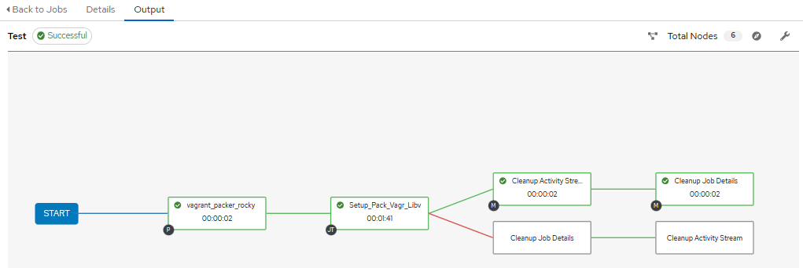
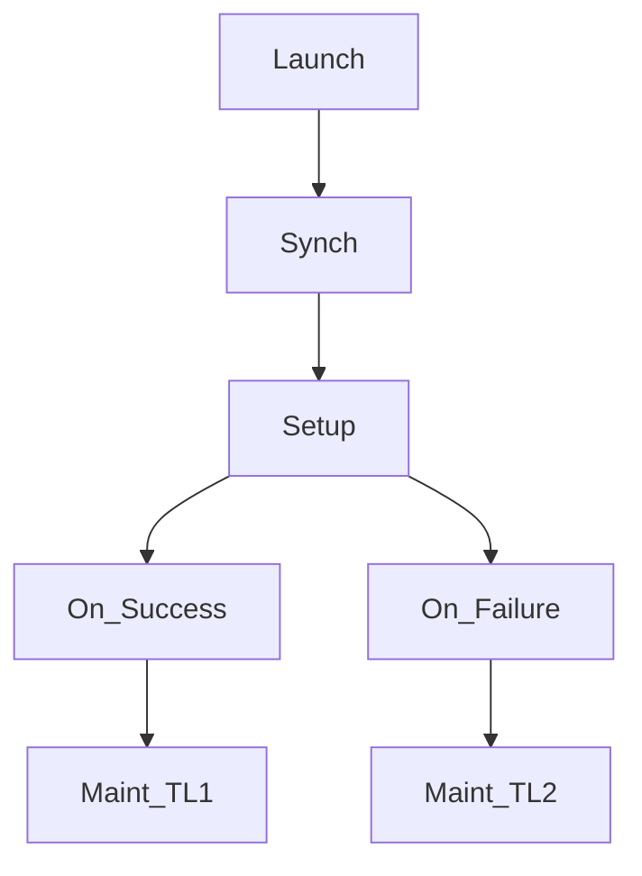

# Nested VM Base Build (awx workflow) 

## Base Test VM

Create a Base Test VM to support quick provisioning of nested virtual and immutable testing vms.

**Purpose:**

    Use an environment permissive to implementation of local workflow execution for testing and development.

Setup and install 
- Packer
- Libvirt/Qemu 
- Vagrant
- RDP stuff


## Supplemental Tasks:

### AWX

Basic example:  

AWX Test Workflow using Static Inventory
> Launch -> Project Synch -> Playbook execute -> success conditional -> example maint. tasks

||
|:--:|
| *Simple Workflow* |



#### Supplemenmtal tasks to test and research:

- [ ] Test Utilization of Surveys in the 
- [ ] [todo]? Test Surveys in workflows
- [ ] Dynamic inventories via awx vcenter plugin  
    - [Using VMware vCenter Tags in a Red Hat Ansible Tower Dynamic Inventory](https://www.ansible.com/blog/using-vmware-vcenter-tags-in-a-red-hat-ansible-tower-dynamic-inventory)
- [ ] Execution container collections and roles prestaged

### Task List

Output:
  > **AS OF 25JUL**: [Task List](.Resources/task_list.md)


## Changes

#### 26July2023 

- [x] Add packer plugins install task via copy and content (surely better way to do this):  [tasks file ](tasks/vagpak.yaml)

- [x] Add vagrant plugin install via command module for now: [tasks file](tasks/vagpak.yaml)
  ```yaml
    - name: Install Vagrant and Packer
    import_role:
      name: hashicorp
    vars:
      INSTALL_VAGRANT_PACKER: "{{ INSTALL_VAGRANT_PACKER }}"
    register: vp_install
  
    - name: Install Libvirt vagrant plugin
      shell: vagrant install plugin vagrant-libvirt
      when: vp_install is defined
  ```

#### Changes:

**27July23**:

**Reorg tasks in workflow:**

- [x] 1. Remove clone task
    > **Why:** Reorganized and done at different stage of workflow
- [x] 2. Remove git_user var
    > **Why:** Reorganized and done at different stage of workflow
- [x] 3. Updated basics_install to include venv, setuptools, ansible, and and latest pip
    > **Why:** Support local testing

**28July23**:

- [x] Add Remote user var and kept the basic clone stuff in for now 
- [x] update Group Vars for consitent case

